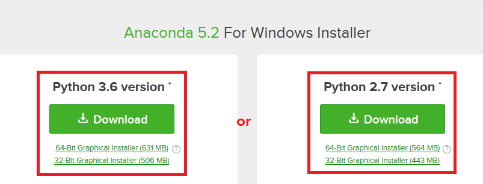

PyTorch Tutorial
================
* 이 튜토리얼은 공식사이트를 참고하여 작성하였습니다. (https://pytorch.org/tutorials/index.html)
---
#### [Install]

1. Anaconda Install
* 파이썬 3.6과 2.7 중 원하는 버전을 다운로드합니다. (https://www.anaconda.com/download/)
* 해당 포스팅은 Python 3.6 vesrion(64bit) 기반으로 작성하였습니다.

2. PyTorch Install

* 아나콘다 프롬프트를 실행하고, 아래의 코드를 입력하세요.

      conda create -n PyTorch python=3.6  
      activate PyTorch  
      conda install pytorch cuda90 -c pytorch  
      pip install torchvision  

  * **conda create**는 환경 생성하는 명령어입니다. PyTorch 뿐만 아니라 Tensorflow 같은 다른 딥러닝 프레임워크를 사용한다거나 하위 파이썬 버전도 사용해야하는 경우 환경마다 설정해주면, 디펜던시가 꼬이지 않아 편합니다.
  * **-n 환경명, python=파이썬버전** 입력하시면 됩니다. 환경설정 리스트는 **conda env list**를 입력하시면 확인하실 수 있습니다.
  * **activate**는 해당 환경을 활성화 시키는 명령어입니다. 반대로 환경을 빠져나오는 명령어는 **deactivate**입니다.
  * 실질적으로 PyTorch를 설치하는 명령어는 **conda install pytorch cuda90 -c pytorch**입니다. 여기서는 **CUDA 9.0 기반의 GPU 버전**을 설치하였습니다. 
  * 기타 환경 설치 방법은 해당 링크에서 확인할 수 있습니다. (https://pytorch.org/) 
  * PyTorch의 경우 numpy와 유사하지만 GPU 기반의 연산을 지원하는 텐서 구조를 지원하므로 GPU 버전을 설치하는 것을 권장합니다.
  * **torchvision**은 딥러닝 학습에 많이 사용되는 데이터셋, 네트워크 구조, 이미지 변환과 같은 기능을 제공하므로 설치하는 것을 권장합니다.

* 정상적으로 설치됐는지 확인하기 위해 아나콘다 프롬프트에 아래의 명령어를 입력합니다.

      python  
      import torch  
      print(torch.tensor(2,2))  

* ~~(tc)는 환경설정 이름으로 위의 과정과 동일하게 설정했다면 (PyTorch)라고 출력이 되야합니다. 만약 (base)라고 출력된다면, 설정하신 환경 설정을 활성화 시켜주시면 됩니다.~~
---
#### [Lab01.py]